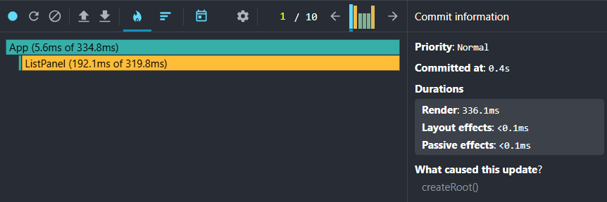
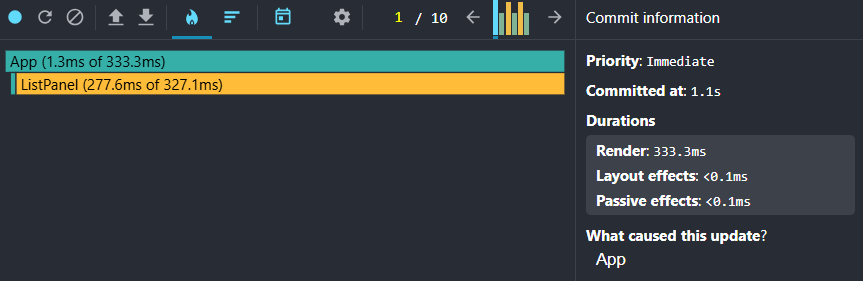
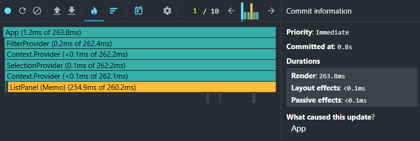

# React Rendering Internals

Small React demo app to prove (via React DevTools Profiler) how reconciliation cost changes with:
- stable keys
- `useMemo` for derived data
- `useCallback` for stable handler props
- `React.memo` (including memoized rows)
- context partitioning (filter vs selection)

## Run

```bash
cd react-rendering-internals
npm install
npm run build
npm run preview
```

## Profiling scenarios

- Scenario A (typing): type ~10 characters in the search input.
- Scenario B (selection): click 10 different rows.

## Profiler results (preview build)

| Scenario | Baseline render (ms) | Optimized render (ms) |
| --- | ---: | ---: |
| A (typing) | 336.1 | 279.4 |
| B (selection) | 333.3 | 263.8 |

Notes:
- Baseline top cost: `ListPanel` (192.1ms / 277.6ms of commit render).
- Optimized top cost: `ListPanel (Memo)` (264.6ms / 254.9ms of commit render).

## Screenshots (Profiler evidence)

### Scenario A (typing)

**Baseline**



**Optimized**


### Scenario B (selection)

**Baseline**



**Optimized**


